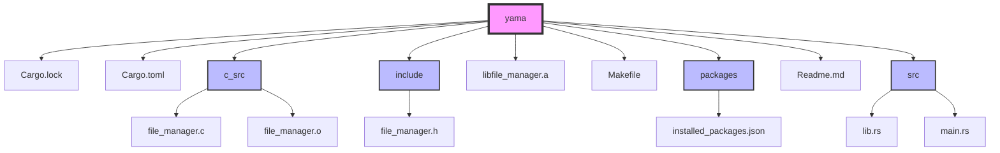

# Yama: A Package Manager You Didn't Ask For, But Here It Is!

Yama is a lightweight package manager designed for performance and safety. Built using C for low-level operations and Rust for higher-level logic, it efficiently manages package installations, including dependency resolution.

## Features

- **Package Management:** Install, remove, and list packages effortlessly.
- **Download and Extraction:** Downloads packages from specified URLs and extracts them for use.
- **Dependency Resolution:** Automatically resolves and installs dependencies for the specified packages. (Working on it)

## Project Structure



## Dependencies

Before running Yama, ensure you have the following dependencies installed:

- **Rust**: Install Rust using [rustup](https://rustup.rs/).
- **Cargo**: The Rust package manager comes with Rust installation.
- **C Compiler**: Make sure you have a C compiler (like `gcc` or `clang`) installed for building C components.
- **libzip**: Required for handling zip files. You can usually install it via your package manager:
  - For Ubuntu/Debian: 
    ```bash
    sudo apt-get install libzip-dev
    ```
  - For Fedora: 
    ```bash
    sudo dnf install libzip-devel
    ```

## Installation

1. Clone the repository:
   ```bash
   git clone https://github.com/V8V88V8V88/yama.git
   cd yama
   ```

2. Build the project:
   ```bash
   cargo build --release
   ```

## Usage

To install a package:
```bash
cargo run -- install <PACKAGE_NAME>
```

To remove a package:
```bash
cargo run -- remove <PACKAGE_NAME>
```

To list installed packages:
```bash
cargo run -- list
```

## Fun Fact

The name "Yama" refers to a significant role player in Hinduism, symbolizing self-discipline and control. Just like Yama, this package manager aims to bring order and efficiency to your software management tasks.

## Another One

Yama is inspired by the now-deprecated YUM package manager and aims to bring a modern touch to package management. Enjoy managing your software packages with ease!
